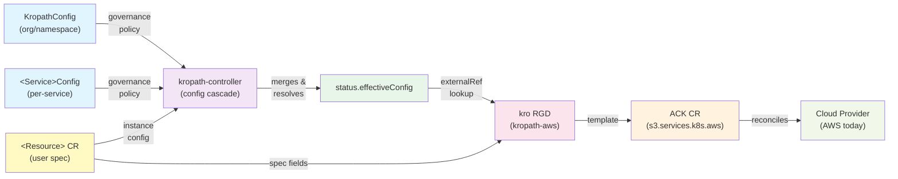

# kropath Architecture

kropath's control plane is built in layers. A platform team declares governance policy, the kropath-controller merges it with application specs, and kro ResourceGraphDefinitions project the result onto Kubernetes-native provider operators that provision cloud resources.

## The Data Flow



## The Components

### Governance CRs

**`KropathConfig`** — Organization-wide or namespace-wide policy:
- Mandatory fields that override anything a user specifies
- Default values for fields the user doesn't set
- Global naming templates and tag prefixes

**`<ResourceFamily>Config`** — Per-service policy (e.g., `S3Config`, `IAMConfig`, `ECSConfig`):
- Service-specific mandatory and default settings
- Service-specific naming templates
- Tagging and label rules

### kropath-controller

The kropath-controller runs the **config cascade reconciler** for each service. It:

1. Watches all governance CRs (`KropathConfig` and `<ResourceFamily>Config`)
2. Watches the user's resource CR (e.g., a single `S3Bucket` instance)
3. Merges the layers under a strict precedence: **mandatory > user spec > defaults**
4. Writes the result to `status.effectiveConfig` on the resource CR

The precedence is the same for every field:
```
1. Global KropathConfig mandatory
2. Local KropathConfig mandatory
3. Global <ResourceFamily>Config mandatory
4. Local <ResourceFamily>Config mandatory
5. User spec field
6. Local <ResourceFamily>Config default
7. Global <ResourceFamily>Config default
8. Local KropathConfig default
9. Global KropathConfig default
10. Service default
```

### kro ResourceGraphDefinition (RGD)

A **ResourceGraphDefinition** is a governance-aware wrapper around a provider operator resource. kropath ships one RGD per resource kind (e.g., one for `S3Bucket`, one for `IAMRole`).

The RGD:

1. Reads the user's `<Resource>` CR (e.g., `S3Bucket`) — which contains only the user's intent
2. Performs one `externalRef` lookup to fetch `status.effectiveConfig` from the user's `<ResourceFamily>Config` — which contains the merged governance policy
3. Merges both into a single view
4. Generates an underlying provider-operator CR (e.g., an ACK `Bucket` CR for AWS)

The RGD never modifies the CRD schema or the `effectiveConfig` — it only reads them and composes the result.

### Provider Operator Layer

The provider operator layer handles the actual cloud API calls:

- **AWS**: AWS Controllers for Kubernetes (ACK)
- **GCP**: Google Cloud Controllers for Kubernetes (KCC, not yet shipped)
- **Azure**: Azure Service Operator (ASO, not yet shipped)

Each operator watches its own CRs (`Bucket`, `Role`, `Topic`, etc.) and reconciles them against the cloud provider's API. The operator is not aware of kropath — it just sees a Kubernetes CR and realizes it as a cloud resource.

### Cloud Provider

The cloud provider (AWS, GCP, Azure) owns the actual resources. Resources are provisioned and updated through the provider's API by the operator.

## Roadmap

- **AWS** is supported today (46 resource kinds implemented across 15 services).
- **GCP** and **Azure** repositories exist in the project but hold no implementation yet — support is not yet available.

## Key Principles

- **Separation of concerns**: governance policy lives in configuration CRs, not in RGD code. Changes to policy don't require redeployment of the controller.
- **No user-facing complexity**: application teams write simple CRs (`S3Bucket { spec: { region: us-west-2 } }`), not Kubernetes-level policy or constraints.
- **Mandatory wins**: platform teams can enforce security or compliance settings that users cannot override.
- **Defaults reduce boilerplate**: common patterns (encryption, tagging, retention) are set once in config, inherited everywhere.
